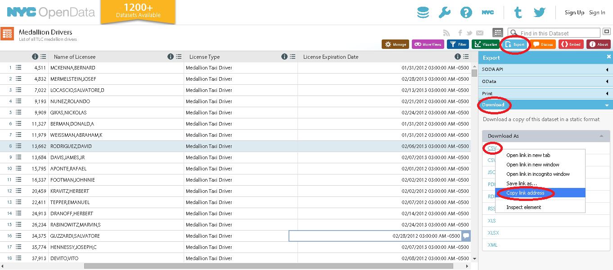

```{r setup, include=FALSE}
knitr::opts_chunk$set(fig.width=7.5, fig.height=5)
```

Around the globe, cities, states, and countries are attempting to be more open and accountable by sharing [open data](http://www.data.gov/open-gov/) with citizens.  

New York City has over 1200 datasets available on [NYC OpenData](https://data.cityofnewyork.us/). There are fewer things more iconic for NYC than a yellow cab, and [NYC OpenData](https://data.cityofnewyork.us/) provides data on the 52 thousand or so taxi and livery medallion drivers in the city.  

The goal of this demo is to find out the most common first and last names of taxi drivers in New York City. 

Along the way this demo  will use the `R` language show you how to:  

- download data directly from the web,
- do some basic clean-up and processing of text strings, and
- make some nice plots with the `R` package `ggplot2`.

<br>
<br> 

# Downloading data 
We will use the function `getURL()` from the R package `RCurl` to download the data. 
```{r, cache=TRUE}
library(RCurl)
URL <- "https://data.cityofnewyork.us/api/views/jb3k-j3gp/rows.csv?accessType=DOWNLOAD"
X <- getURL(URL, ssl.verifypeer = FALSE)
data <- read.csv(textConnection(X))
```

<br> 

You can find the URL by going to [NYC OpenData](https://data.cityofnewyork.us/) and searching for the "Medallion Drivers" data set.  
Then, click on "Export" > "Download" > "CSV" and Right click "Copy link address."



<br>
<br> 

# Examine the data 
```{r}
names(data)
```
You can see we only have six variables in the dataset, including the license number, names, and expiration dates of their taxi medallion. The "Last.Updated" variables tell you the last time the entry in the database was updated.  

```{r}
dim(data)
```
You can also see that there are over 52 thousand taxi driver in NYC!

```{r}
str(data)
```
`str()` is a useful function to see how `R` is treating each of the different variables, e.g., is it a number, factor, etc.? The variable we are interested in - `Name` - is a factor with 44837 unique levels. That means that some of the 52 thousand drivers have the same name!

<br>
<br> 

# Data clean-up 
If you look at the variable `Name` you can see that it includes first and last names and sometimes middle initials. We are going to need to separate out this variable into separate columns for each. 
```{r}
data$Name[1:20]
```


First let's convert `Name` to a character
```{r}
data$Name <- as.character(data$Name)
```

Now, we're going to use the `cSplit()` function from the package `splitstackshape` to split the `Name` variable at the commas. This will result in a new column (variable) for each. Make sure you specify `drop=FALSE` in order to keep the original `Name` variable.

```{r}
library(splitstackshape)
data <- cSplit(data, splitCols="Name", sep=",", drop=FALSE)
```

```{r}
names(data)
```
You can see that `cSplit` made more columns than First name, Last name, Middle name or initial. In fact there are now 6 name columns. That means there are some drivers with up to 6 elements to their name! 

<br>
<br> 

# Rearrange data for plotting 

We are going to use the function `aggregate()` to count up the different first and last names. 

```{r}
last_names <- aggregate(data$Name_1, by=list(data$Name_1), length)
colnames(last_names)[1] <- "name"
colnames(last_names)[2] <- "count"
last_names <- last_names[order(last_names$count,decreasing=TRUE),]

first_names <- aggregate(data$Name_1, by=list(data$Name_2), length)
colnames(first_names)[1] <- "name"
colnames(first_names)[2] <- "count"
first_names <- first_names[order(first_names$count,decreasing=TRUE),]
```

We don't want to plot all of the names so let's just take the top 30: 
```{r} 
last_names_top30 <- last_names[1:30,]
last_names_top30 
first_names_top30 <- first_names[1:30,]
first_names_top30
```

<br>
<br> 

# Plotting 

```{r}
library(ggplot2)

plot_first_names <- ggplot(first_names_top30, aes(reorder(name,-count),count)) + geom_bar(stat="identity")
plot_first_names <- plot_first_names + xlab("First Name") + ylab("Number")
plot_first_names <- plot_first_names + theme_classic(base_size=12)
plot_first_names <- plot_first_names + theme(axis.text.x=element_text(angle=45, hjust=1))
plot_first_names

plot_last_names <- ggplot(last_names_top30, aes(reorder(name,-count),count)) + geom_bar(stat="identity")
plot_last_names <- plot_last_names + xlab("Last Name") + ylab("Number")
plot_last_names <- plot_last_names + theme_classic(base_size=12)
plot_last_names <- plot_last_names + theme(axis.text.x=element_text(angle=45, hjust=1))
plot_last_names

```

For first names you'll notice that there are at least five different versions or spellings of the name "Muhammad" in the top 30 names. Let's aggregate those into one. (Note: "MD" is an [abbreviation for Muhammad](http://en.wikipedia.org/wiki/Bangladeshi_name)).

<br>
<br> 

# Combining the name "Muhammad"
We'll merge some of the most common spellings of "Muhammad" into one. 
```{r}
# combine different version of "MOHAMMAD" into one 
names_fixed <- data 
names_fixed$Name_2[names_fixed$Name_2=="MD"] <- "MOHAMMAD"
names_fixed$Name_2[names_fixed$Name_2=="MOHAMMED"] <- "MOHAMMAD"
names_fixed$Name_2[names_fixed$Name_2=="MUHAMMAD"] <- "MOHAMMAD"
names_fixed$Name_2[names_fixed$Name_2=="MOHAMED"] <- "MOHAMMAD"

# re-aggregate
first_names_fixed <- aggregate(names_fixed$Name_2, by=list(names_fixed$Name_2), length)
colnames(first_names_fixed)[1] <- "name"
colnames(first_names_fixed)[2] <- "count"
first_names_fixed <- first_names_fixed[order(first_names_fixed$count,decreasing=TRUE),]

#  take the top 30 
first_names_fixed_top30 <- first_names_fixed[1:30,]
```


Now, let's replot the first names 
```{r}
plot_first_names_fixed <- ggplot(first_names_fixed_top30, aes(reorder(name,-count),count)) + geom_bar(stat="identity")
plot_first_names_fixed <- plot_first_names_fixed + xlab("First Name") + ylab("Number")
plot_first_names_fixed <- plot_first_names_fixed + theme_classic(base_size=12)
plot_first_names_fixed <- plot_first_names_fixed + theme(axis.text.x=element_text(angle=45, hjust=1))
plot_first_names_fixed
```

<br>
<br> 

# Summary 
There you go. **"Singh"** is the most common last name and **"Muhammad"** and all of its spelling variations is the most common first name for NYC Taxi Drivers!
